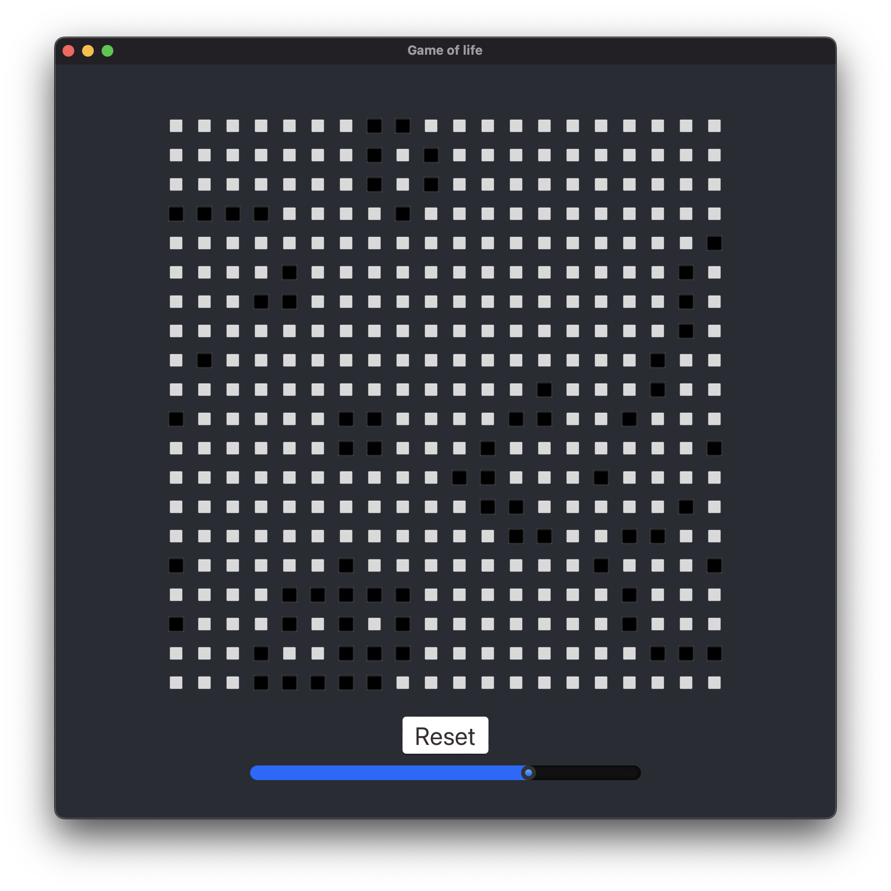

# game-of-life

Game of Life using Tauri, React and Rust



# Requirements

1. Rust
   https://www.rust-lang.org/tools/install

2. Tauri Cli (cargo is the package manager for rust).  
   > `cargo install tauri-cli --version "^1.0.0"`

3. NPM  
   npm comes bundled with node  
   https://nodejs.org/en/download

4. Installing frontend dependencies:  
   Run the following command to install the dependancies.  
   > `npm install`

# Running

Run the following command to launch the fronend server after compiling and running Rust backend  
> `cargo tauri dev`

# Distributation

This command embeds your web assets into a single binary with your Rust code. The binary itself will be located in ```src-tauri/target/release/[app name]```, and installers will be located in ```src-tauri/target/release/bundle/```.     

> `cargo tauri build`
